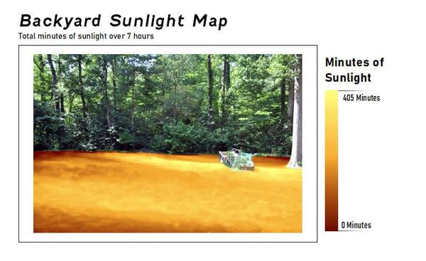
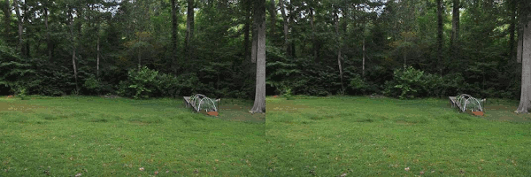
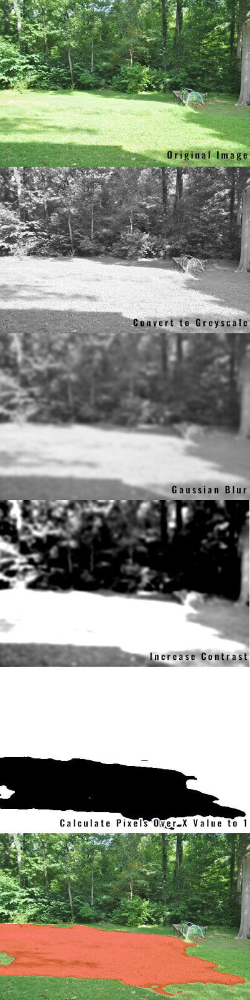
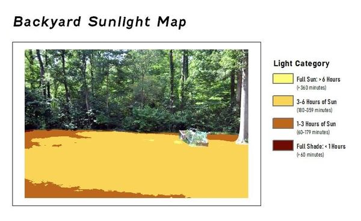

# Sunlight Map
*Detects sunlight in image series and creates a map differentiating between "full sun", "partial sun", and "shade" for gardening purposes.*

### Background
During the pandemic, like everyone else, I sepent a lot more time around the house than usual.  Working from home in front of my back window, I started to wonder why we have such bad luck with the veggies in our raised bed.  Maybe they don't get enough sunlight?  I decided to make a sunlight map to determine which areas have full sun, partial sun, and shade lighting.  Any normal person would look out the window and take notes on where the shadows are every 30 minutes or so, but I decided to have python and my camera do the work for me.

### Camera Setup
I used my Nikon DSLR on a tripod with a remote shutter release.  I set the timer to take a picture every 5 minutes.  This creates a timelapse image series that will be used as the input for my python.  For best results, I found that I had to use full manual mode, setting the exposure for the brightest time of day.  If I allowed it to set exposure automatically, I fount that it misclassified the shadowy areas as sunlit towards the begining and end of the day.

### Processing Images
The script finds sunlit areas by simple image manipulation using the Pillow library.  For each image in the series, the script needs to determine which areas are in the shade and which areas are in direct sunlight.  It does this by first converting the image to greyscale, blurring the image to remove some of the noise, then boosting the contrast so that the sunlit areas clearly stand out from the shade.  Any area with a value over a certain number (the 'v' parameter in the create_sunlight_map() function) is considered sunlit.  Finally a "sunlight map" is created for each image.  Finding the value of v, as well as the amount of blur and contrast needed, takes some trial and error and differs by the color of the ground cover.  An optional mask image can be used to only analyze a certain area of the image.  Otherwise the sky or structures in the scene will be included in the analysis.

### Finished Product
Once each image has been analyzed, all of the sunlight maps are added together to determine how long any given area was exposed to direct sunlight.  Sunlit pixels of each sunlight map is assigned a value of 1, then is multiplied by the number of minutes between each exposure (5 minutes in my case).  Then each of these values are added together in a single output tif.

Right now the script doesn't do anything else to display the output besides saving the tif file - maybe next gardening season I'll have it create a pretty output image.  I made these by importing the output tif into ArcMap and adding a legend in the layout editor:

### Limitations
This simple classification method works best if all of the area of interest is the same material, like the grass in my back yard.  If the area has varied material, like grass in some places, bare dirt in others, and mulch in others, then the script will have a more difficult time correctly identifying direct sunlight.  One solution would be to create a mask for each surface type and run the analysis for each mask (using the v, blur, and contrast values that work for that surface type).  Then stitch the outputs together for a final output.
